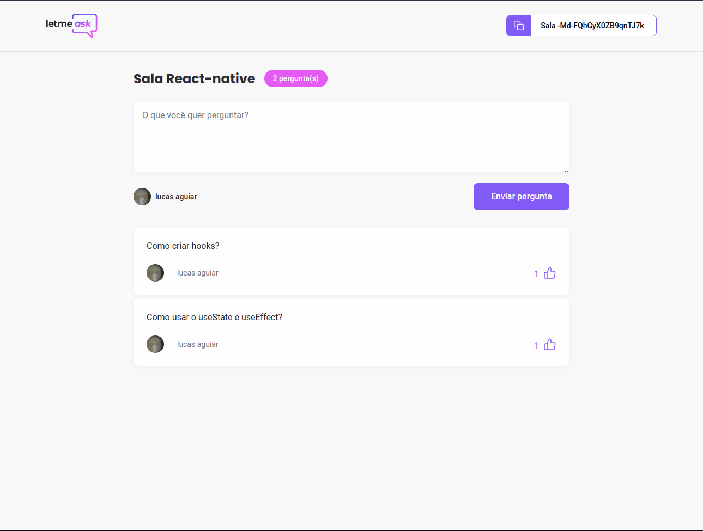

<h1 align="center">
  
   
   
 Letmeask
</h1>

<h4 align="center">NLW Rocketseat</h4>

  <a href="#rocket-technologies">Technologies</a>

  
   

## :rocket: Technologies

- [ReactJS](https://pt-br.reactjs.org/)
- [Typescript](https://www.typescriptlang.org)
- [Styled-components](https://www.styled-components.com/)
- [Sass](https://sass-lang.com/)
- [Firebase](https://firebase.google.com/)

---

Made with ♥ by Lucas Aguiar :wave: [Get in touch!](https://www.linkedin.com/in/lucasaguiiar)
